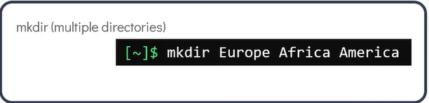

1. shell allows text based interactions with a machine.

pwd - present working directory

ls - List contents

mkdir - make a new directory

To create multiple directories at a time, we can add the directory names as arguments separated by space

        